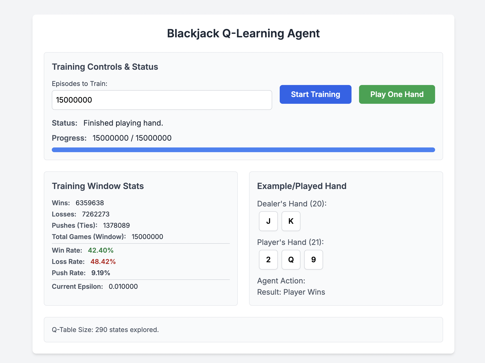

This project demonstrates a simple Reinforcement Learning (RL) agent learning to play Blackjack using the Q-learning algorithm. The entire simulation runs directly in your web browser using HTML, CSS (Tailwind), and JavaScript.
The agent learns a strategy similar to basic Blackjack strategy by playing thousands of simulated games against a dealer.

